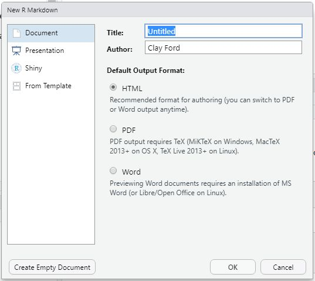
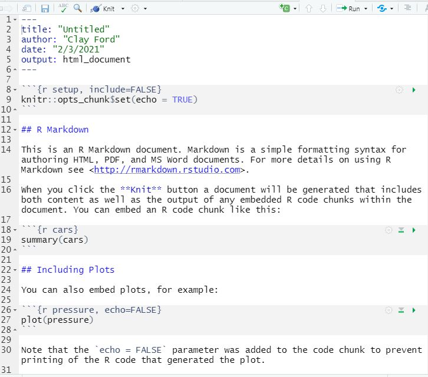
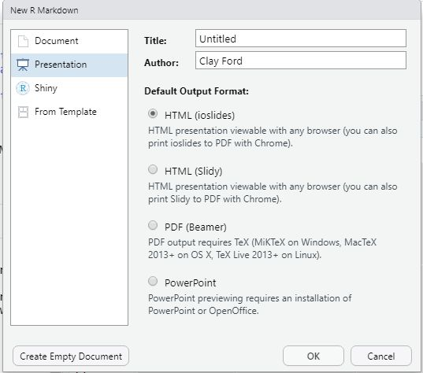

```{r setup, include=FALSE}
library(dplyr)
library(scales)
knitr::opts_chunk$set(echo = TRUE)

URL <- "https://github.com/uvastatlab/phdplus2022/raw/main/data/albemarle_homes_2022.rds"

homes <- readRDS(url(URL)) %>% 
  filter(hsdistrict != "Unassigned")

medians <- homes %>% 
  group_by(hsdistrict) %>% 
  summarise(n = comma(n()), 
            median_value = dollar(median(totalvalue)))
```

## R Markdown: what is it and why use it?

Markdown is a simple plain-text formatting syntax created in 2004. For example, surrounding words with asterisks creates italics:

`*Hello*` is rendered as *Hello*.

We'll talk about how it gets rendered in a moment.

Go to Help...Markdown Quick Reference in RStudio to see more Markdown syntax. It takes about 60 seconds to learn the fundamentals of Markdown.

**R** Markdown is a version of Markdown that allows R code [@rcore] to be included as "chunks". This allows us to combine narration and exposition along with R code and its output in one file. This is easier and less error-prone than, say, using MS Word to write up results and copy-and-pasting results out of R into Word.

Most everything I know about R Markdown is courtesy of the free online book, [R Markdown: The Definitive Guide](https://bookdown.org/yihui/rmarkdown/) [@rmd]

This web page was created in RStudio using R Markdown. The R Markdown book I just mentioned was created using R Markdown. With R Markdown, you can...

-   create reports in PDF, HTML, or Word.
-   create notebooks in which you can directly run code chunks interactively
-   make slide decks for presentations
-   Produce dashboards with interactive layouts
-   Build interactive applications based on the Shiny framework
-   Write journal articles
-   Author books of multiple chapters
-   Generate websites and blogs

The spirit of R Markdown is summarized with this quote in the Introduction of R Markdown: The Definitive Guide [-@rmd]:

> "Wealth consists not in having great possessions, but in having few wants."

In other words, it was designed to satisfy those who simply want to write and not be saddled with typesetting work (eg, LaTeX)[^1]. Rest assured, R Markdown can accommodate complex output requirements. But the primary motivation of R Markdown is to allow you to succeed with simplicity.

[^1]: [The \#1 Reason Why I Don't Want to Work in Academia: Formatting Papers Is A Huge Waste of Time](https://yihui.org/en/2017/12/formatting-papers/)

## Starting an R Markdown document

1.  In RStudio, File...New File...R Markdown...
2.  Use the wizard that opens to select Document or Presentation and the desired output format (HTML, PDF, Word, etc).
3.  Click OK to create a template to get you started.



*The "Shiny" option starts a template for creating a document or presentation with interactive Shiny components, such as a plot with sliders to interact with the plot. The "From Template" option allows you to open a template with settings specific for a particular journal or project. Both are beyond the scope of today's session, though I encourage you to play with them.*

The template that opens contains useful information about how to use R Markdown. You should read through it at least once. Here's the basic HTML Document template:



The template says to click the **Knit** button to convert the R Markdown file to an HTML document. When you do that, you will be prompted to save the R Markdown file (if you haven't already). No need to add an extension; RStudio will add a ".Rmd" extension for you. Wherever you save the R Markdown file is where the generated HTML file will be created. RStudio will open a preview of the file for you to review. That is the file you would share with, send, or present to your audience.

### Exercise 1

1.  In RStudio, go to File...New File...R Markdown...
2.  Select Document - HTML, click OK. (Just leave the title as "Untitled".)
3.  Save the file (Ctrl + S or Cmd + S) as "alb_homes_report". **Save the file in the folder created when you unzipped the workshop files, which should be called `05_using_r_markdown`.** (In other words, save it where the "refs.bib" file is located.)
4.  click Knit.
5.  Compare the R Markdown file to the output. The output should pop up in a preview window.
6.  Close the preview and find the HTML file on your computer.

## Starting an R Markdown presentation

We can use R Markdown to create slides for a presentation. At the time of this writing there are four output formats:



As with a document, when you start a new R Markdown presentation you get a template with some basic instructions.

One major difference between documents and presentations is that a header created with `##` becomes the title of a *new slide*.

Today's session will involve learning R Markdown in the context of a HTML document, but most everything we learn will translate to presentations.

See [Chapter 4](https://bookdown.org/yihui/rmarkdown/presentations.html) of the R Markdown book [-@rmd] for details on presentations.

## An R Markdown Workflow

Once you start and save an R Markdown file, or Rmd file, you need to erase some or all of the template and start typing your own content. Here's a suggested workflow:

1.  Open up the Markdown Quick Reference (Help...Markdown Quick Reference) so it's handy

2.  Start writing and coding

3.  Click **Knit** to get a preview, or use keyboard shortcuts:

    -   Ctrl + Shift + K (Win/Linux)
    -   Cmd + Shift + K (Mac)

4.  Repeat steps 2 and 3 as needed.

## Adding R code chunks

To add R code to a R Markdown file it must be in a "chunk". A stand-alone chunk begins with ```` ```{r} ```` and ends with ```` ``` ````. Fortunately there is a keyboard shortcut for inserting a chunk:

-   Ctrl + Alt + I (Win/Linux)
-   Cmd + Option + I (Mac)

You can also use the green insert code chunk button.

We have a lot control of chunks via chunk options, which can be provided inside the curly braces. For example, hide the code that produces a plot, and set the plot dimensions to 5in x 5in:

```` ```{r echo = FALSE, fig.width = 5, fig.height = 5} ````

Hitting Tab after the "r" in the curly braces produces a menu of available options. Notice options must be separated with a comma.

Good to know options:

-   `eval`: TRUE or FALSE, whether to evaluate code or not. Good for showing R code but not actually running it.
-   `echo`: TRUE or FALSE, whether to show R code along with output. FALSE will show output but not the R code that produced the output.
-   `message`: TRUE or FALSE, whether to show messages. FALSE will suppress start-up messages that say things like "Attaching package: 'dplyr'" or "Please cite this package...".
-   `include`: TRUE or FALSE, whether to include anything from a code chunk in the output document. FALSE will evaluate the code but not show the code or the results. Useful for running code that doesn't need to be seen such as loading packages or data.
-   `warning`: TRUE or FALSE, whether to display warnings messages. FALSE will suppress warnings like a package being built under a previous version of R, or a deprecated function.
-   `fig.width`, `fig.height`: Absolute width and height of the plot in inches. Defaults are 7.
-   `out.width`, `out.height`: Scaled width and height of the plot in the output document. Expressed as percentage (eg, "50%")

To globally set an option for all chunks, add it to the `opts_chunk$set` at the top of the Rmd file. For example, set all chunks to show code and suppress any messages:

`knitr::opts_chunk$set(echo = TRUE, message = FALSE)`

You can also label code chunks. For example, here's a chunk labeled "plot-1":

```` ```{r plot-1, echo = FALSE, fig.width = 5, fig.height = 5} ````

Code chunk labels must be unique. I tend not to label chunks until I need to.

A list of available options: <https://yihui.org/knitr/options/#chunk-options>

See also [Section 2.6](https://bookdown.org/yihui/rmarkdown/r-code.html) of the R Markdown book [-@rmd].

### Exercise 2

Go to your "alb_homes_report.Rmd" file.

1.  Delete the example text (everything from line 12 on down)
2.  Update the `title:` field in the metadata at the top of the file. Call it "Albemarle Homes Report". Make sure to use quotes.
3.  In the first code chunk that begins `{r setup, include=FALSE}`, add the following code. This loads the packages we're going to use, creates some objects we'll use, and does some data wrangling.

```{r eval=FALSE, results='asis'}
library(tidyverse)
library(scales)
library(plotly)

URL <- "https://github.com/uvastatlab/phdplus2022/raw/main/data/albemarle_homes_2022.rds"

homes <- readRDS(url(URL)) %>% 
  filter(hsdistrict != "Unassigned")

medians <- homes %>% 
  group_by(hsdistrict) %>% 
  summarise(n = comma(n()), 
            median_value = dollar(median(totalvalue)))

homes_year_hs <- homes %>%  
  filter(yearbuilt >= 2000) %>% 
  group_by(hsdistrict) %>% 
  count(yearbuilt)
```


4.  Next add a level 2 header that says "Home Values". Don't forget the Markdown Quick Reference if you need help.
5.  Hit Enter a couple of times and enter these two sentences:

```
In this report we examine Albemarle County real estate data using the R Statistical Computing Environment. Visualizations were created with the ggplot2 and plotly packages.
```

6.  Hit Enter a couple of times and add a new R code chunk. In it, add the following code:

```{r eval=FALSE, results='asis'}
medians
```

7.  Knit the document to see what you have so far. Ctrl + Shift + K (Win/Linux) or Cmd + Shift + K (Mac)

## What happens when we Knit

When we "Knit" a document, the following happens:

-   the `knit` function from the {knitr} package executes the R code embedded in Markdown -- **in a new R session** -- and converts R Markdown (.Rmd) to Markdown (.md)
-   the `render` function from the {rmarkdown} package converts the Markdown to the output you specified (HTML, PDF, etc) using a program called pandoc.

This all happens under the hood so we don't really need to worry about it. But we do need to be aware of the bolded part: **in a new R session**

Rendering an Rmd document **in a new R session** means that none of the objects in your current R session are available. Exercise 3 demonstrates this.

### Exercise 3

1.  In your R console, at the prompt, input the following and hit Enter: `x <- 2022`
2.  Go to your "alb_homes_report.Rmd" file, add a code chunk at the very bottom, and enter `x` in the code chunk.
3.  Knit the document and notice the error. That occurs because the Rmd file was rendered in a new session in which `x` did not exist.
4.  Delete the code chunk.

## Creating Tables

At the end of exercise we saw the following in our Albemarle Homes output:

```
## # A tibble: 3 x 3
##   hsdistrict        n      median_value
##   <fct>             <chr>  <chr>       
## 1 Albemarle         12,559 $377,500    
## 2 Monticello        10,584 $388,000    
## 3 Western Albemarle 9,361  $500,400

```

That doesn't look bad, but our audience probably doesn't care if it's a 3 x 3 "tibble". And metadata like `<fct>` and `<chr>` are just going to confuse them. And why are there a bunch of pound signs? Fortunately we have some options for easily producing tables. A popular function for this is the `kable` function in the {knitr} package. Simply use it with a data frame, like so:

```{r}
knitr::kable(medians)
```

Using two colons between a package and its function allows us to use that function without loading the package.

Useful arguments for the `kable` function include:

-   `caption`: A caption for the table
-   `col.names`: Nice names for the columns as a character vector
-   `align`: column alignment(`l` (left), `c` (center), `r` (right))

If our data frame had four columns and we wanted them aligned left, left, center, right, we could align them as follows: `knitr::kable(name_of_data_frame, align = "llcr")`

See [section 10.1](https://bookdown.org/yihui/rmarkdown-cookbook/kable.html) of The R Markdown Cookbook [-@rmd_cookbook] for more examples of the `kable` function.

There are MANY packages for formatting tables in R. RStudio is backing an ambitious package called {gt}. The {gt} package [home page](https://gt.rstudio.com/) has a good overview of the leading packages for creating tables.

### Exercise 4

Go to your "alb_homes_report.Rmd" file.

1.  Use `knitr::kable` with the `medians` data frame.

```
-   set the `caption` to `"Median home values by high school district"`
-   set `col.names` to `c("HS District", "Number of Homes", "Median Value")`
-   set `align` to left, center, center for the 3 columns
```

2.  Set echo option to FALSE for the chunk option.

3.  Knit and inspect

## Adding Plots and Images

Including R plots is straight forward: add a code chunk and insert your code. The plot will appear immediately after the code chunk. If the plot is interactive (eg, generated with `ggplotly()`), it is embedded as a functioning interactive plot.

You can add images using Markdown as follows: `` (see the Markdown Quick Reference)

You can also add images using R code chunks with `knitr::include_graphics('path/to/image')` which provides more control over the attributes of the image than the Markdown syntax. For example, you can specify the image width via the `out.width` chunk option, which allows you to scale down a large image.

### Exercise 5

Go to your "alb_homes_report.Rmd" file.

1.  Add the following code in a new code chunk, under the table code chunk, with the echo option set to TRUE (the default).

```{r eval=FALSE, results='asis'}
p <- ggplot(homes_year_hs) +
  aes(x = yearbuilt, y = n, color = hsdistrict) +
  geom_line() +
  scale_color_discrete("High School\nDistrict") +
  labs(x = "Year Built", y = "Number Homes Built",
       title = "Number of Homes Built Since 2000")
ggplotly(p)
```

2.  Knit the document and inspect

The `ggplotly()` function from the plotly package takes a plot created with ggplot2 and makes it interactive.[^2]

[^2]: to export an interactive plot into a stand-alone HTML file, use the `htmlwidgets::saveWidget()` function. For example to save the plot above as plot.html, we would run the following code: `htmlwidgets::saveWidget(as_widget(ggplotly(p)), "plot.html")` Notice we need to call `ggplotly()` on our plot object, and then call `as_widget()` on our plotly object. 

## Inline R code

We can also add R code inline with text. This is useful for reporting specific values. For example, we could automatically determine the number of rows in our homes data frame and report in a sentence, like so:

```{r eval=FALSE}
In this report we examine `r nrow(homes)` homes.
```

Which would be rendered as:

In this report we examine `r nrow(homes)` homes.

Results will always appear as text without code. This is useful for inserting a value from, say, a statistical analysis that may change as more or less data become available. Or inserting dates or package versions that may change over time. For example:

This...

```{r eval=FALSE}
The report was written using R version `r getRversion()`
```

gets rendered as...

This report was written using R version `r getRversion()`

Recall the medians table:

```{r echo=FALSE}
knitr::kable(medians)
```

We may want to write a summary of this table. Instead of actually typing the median values or counts, we can pull them from the data frame insert them into our exposition using inline R code chunks. That way if we re-run the report at a later date with different data, the new summary statistics will automatically be updated in the paragraph.

For example, "The median home value in the Monticello high school district is `r medians$median_value[medians$hsdistrict == "Monticello"]`."

We can extract the value from the medians data frame as follows:

```{r eval=FALSE}
medians$median_value[medians$hsdistrict == "Monticello"]
```

Or this works, too (though some people frown on hard-coding numbers into R chunks):

```{r eval=FALSE}
medians$median_value[2]
```

We can then insert that code into the sentence using an inline R code chunk, like so:

```{r eval=FALSE, highlight=FALSE}
The median home value in the Monticello high school district is `r medians$median_value[2]`.
```

It is also worth noting that using backticks without `r` formats text as code or plain text. This can be useful when we don't want code evaluated. For example, here we explain how the `summary()` function works.

```{r eval=FALSE, highlight=FALSE}
 `summary(homes$totalvalue)` returns summary statistics for the totalvalue column. 
```

Renders as:

`summary(homes$totalvalue)` returns summary statistics for the totalvalue column.

### Exercise 6

Go to your "alb_homes_report.Rmd" file.

1.  In the "Home Values" section, add the following paragraph using inline R code to get the values. Add this immediately following the opening paragraph.

```
The median home value in the Western Albemarle high school district is currently <median>, which is much higher than median home values in the Monticello and Albemarle districts. The Albemarle high school district has the most homes with <n>. 
```

Hint: Here's the code to get the values:

```{r eval=FALSE}
# <median>
medians$median_value[medians$hsdistrict == "Western Albemarle"]
# <n>
medians$n[medians$hsdistrict == "Albemarle"]

```

2.  At the bottom of the file, add the following sentences and use inline R code to populate the date and versions. I suggest using the functions `Sys.Date()`, `getRversion()`, `packageVersion("ggplot2")`, and `packageVersion("plotly")`, respectively.

```
This report was generated on <date> using R version <version>. Plots created with the ggplot2 (version <version>) and plotly (version <version>) packages.
```

3.  Knit the document and inspect


## Using LaTeX to format math expressions

LaTeX is a sophisticated language for typesetting and is especially good for formatting math. Just about any journal article or book that features professional looking math or statistics almost certainly used LaTeX to create the math expressions. R Markdown allows us to use LaTeX "on the fly" in HTML documents for formatting math as we need it. (When you use R Markdown to create PDF documents, you're using LaTeX under the hood. Within R Markdown documents that generate PDF output you can use raw LaTeX.)

To use LaTeX to create a math expression, use a set of two dollar signs for a "display" equation, or use a set of one dollar sign for an "inline" expression.

```
This is display:
$$y = x^2$$

This is inline: $y = x^2$
```

This is display:

$$y = x^2$$

This is inline: $y = x^2$

If you need to enter literal dollar signs in R Markdown or a LaTeX expression, escape them with a backslash to prevent them from being interpreted as LaTeX code. For example in R Markdown, `The home cost \$400,000` will be rendered as the home cost \$400,000.

There are many online LaTeX equation generators. Here's one I like: <https://www.hostmath.com/>

### Exercise 7

Go to your "alb_homes_report.Rmd" file.

1.  Add the following sentence and LaTeX chunk below the code chunk that generates the table:

```
The current real estate tax rate in Albemarle County is \$.854 per hundred of assessed value. For example, a home valued at \$400,000 will owe the following:

$$ \frac{\$400,000}{100} \times \$0.854 = \$3,416 $$
```

2.  Knit the document and inspect

## Adding links

R Markdown will render any URL into an active link. However if you want to name the link you need to use the following syntax:

```
[name](URL)
```
For example:

```
[PhD Plus](https://phdplus.virginia.edu/) is a university-wide initiative to prepare PhD students and Postdoctoral scholars to become influential professionals in every sector and field.
```

Renders as:

[PhD Plus](https://phdplus.virginia.edu/) is a university-wide initiative to prepare PhD students and Postdoctoral scholars to become influential professionals in every sector and field.

When users click the link, they will leave your page. To have the link open a new tab, we need to use HTML. Markdown supports HTML, so that is allowed. To make the link open in a new tab, we could use the `<a>` tag with the appropriate attributes.

```
<a href="https://phdplus.virginia.edu/" target="_blank" rel="noopener noreferrer">PhD Plus</a> is a university-wide initiative to prepare PhD students and Postdoctoral scholars to become influential professionals in every sector and field.
```

<a href="https://phdplus.virginia.edu/" target="_blank" rel="noopener noreferrer">PhD Plus</a> is a university-wide initiative to prepare PhD students and Postdoctoral scholars to become influential professionals in every sector and field.

### Exercise 8

Go to your "alb_homes_report.Rmd" file.

1. Link the phrase "current real estate tax rate" to `https://www.albemarle.org/Home/Components/News/News/249/` (use either Markdown or HTML)
2. Knit the document and inspect

## References and Citations

It's fairly easy to use a citation database with R Markdown. @rmd recommend using BibTeX databases because they work better with PDFs.

A BibTeX database is a text file with a `.bib` extension that contains entries that look like this:

```
@book{rmd, 
      place={Boca Raton}, 
      title={R Markdown: the definitive guide}, 
      ISBN={9780429782961}, 
      publisher={CRC Press, Taylor and Francis Group}, 
      author={Xie, Yihui and Allaire, J. J. and Grolemund, Garrett}, 
      year={2019}
      }
```

This web page uses a BibTeX database called "rmarkdown.bib". Again, this is just a text file.

A quick way to generate entries in BibTeX format is to go to a site like <https://zbib.org/> and let it do it for you. Just enter a URL, or an ISBN number, or an arXiv ID, etc, and it will create an entry for you. Of course there are whole software programs for this such as Zotero, RefWorks, and EndNote, to name a few.

The first string in the curly braces above is the *label*. The label above is "rmd". I created that label. We use the label when we want to insert a citation in a R Markdown document.

There are three ways to insert citations. Here we demonstrate all three:

```
1. R Markdown was first introduced in the knitr package [@rmd].
```

1.  R Markdown was first introduced in the knitr package [@rmd].

```
2. The R Markdown book [-@rmd] is widely referenced in the RStudio community.
```

2.  The R Markdown book [-@rmd] is widely referenced in the RStudio community.

```
3. @rmd recommend using RStudio with R Markdown.
```

3.  @rmd recommend using RStudio with R Markdown.

For the citations to work, the R Markdown file needs to know where to look for the citations. We specify this by adding `bibliography: file.bib` to the header. This will assume the bib file is in the same directory as the Rmd file. For example, the header for the Rmd file that generated this page has the following header:

```
---
title: "Reporting and Presenting Data using R Markdown"
author: "Clay Ford"
date: "March 3, 2021"
output: html_document
bibliography: rmarkdown.bib
---
```

By using a citation from a BibTeX file in R Markdown, a reference is automatically generated and inserted at the end of the document. You do not have to use all entries in a BibTeX file, and they don't have to be stored in any order. Only those references that are cited will be automatically added at the end of the report in the correct order. To add sections *after* the references (eg, an appendix), see [section 4.5](https://bookdown.org/yihui/rmarkdown-cookbook/bibliography.html) of the R Markdown Cookbook [-@rmd_cookbook].

By default, a Chicago author-date format for citations and references is used. To use another style, you need to specify a Citation Style Language (CSL) file in the `csl` metadata field. See [section 4.5](https://bookdown.org/yihui/rmarkdown-cookbook/bibliography.html) of the R Markdown Cookbook [-@rmd_cookbook] for more information.

Create a BibTeX citation for R with `citation()`. Create a BibTeX citation for R packages with `citation("package-name")`.

### Exercise 9

The workshop files included a file called "refs.bib". Make sure it's in the same place you created your "alb_homes_report.Rmd" file. You can view it with any text editor such as Notepad or TextEdit, or in RStudio.

Go to your "alb_homes_report.Rmd" file.

1.  Add the following to the bottom of the header of your Rmd file: `bibliography: refs.bib`
2.  Add citations in the opening paragraph, like so:

```
In this report we examine Albemarle County real estate data [@albemarle] using the R Statistical Computing Environment [@R-base]. Visualizations were created with the ggplot2 [@ggplot] and plotly [@plotly] packages.
```

3.  At the very bottom of the Rmd file, add a level 2 header titled References
4.  Knit the document and inspect

## Set Output Options and Sub-Options

Render options are set in the Rmd header. The default header for an HTML document is as follows:

```
title: "Untitled"
author: "Your Name"
date: "Today's date"
output: html_document
```

Changing "html_document" to "pdf_document" results in a PDF file being rendered when knitting (assuming you have LaTeX installed). The RStudio wizard you use when starting a Rmd file populates this for you, but you can manually edit.

The output options have *sub-options*. Sub-options allow you to do things like automatically number sections and add a table of contents. Here is an example that adds a table of contents that floats to the left of your document. Note the formatting.

```
title: "Untitled"
author: "Your Name"
date: "Today's date"
output: 
  html_document:      # indent two spaces
    toc: true         # indent four spaces
    toc_float: true   # indent four spaces
```

To automatically number sections (ie, headers produced using `#` signs), set `number_sections: true`

To allow R code to be hidden/revealed, set `code_folding: hide`.

The `theme` sub-option specifies the theme to use for the page, which changes the appearance and style of your page. Valid themes include:

-   default
-   cerulean
-   journal
-   flatly
-   darkly
-   readable
-   spacelab
-   united
-   cosmo
-   lumen
-   paper
-   sandstone
-   simplex
-   yeti
-   null (for no theme)

The `highlight` sub-option specifies the syntax highlighting style. Supported styles include:

-   default
-   tango
-   pygments
-   kate
-   monochrome
-   espresso
-   zenburn
-   haddock
-   breezedark
-   textmate
-   null (to prevent syntax highlighting)

This document uses the `readable` theme and `textmate` highlighting.

```
title: "Reporting and Presenting Data using R Markdown"
author: "Clay Ford"
date: "March 3, 2021"
output: 
  html_document:
    theme: readable
    highlight: textmate
    bibliography: rmarkdown.bib
```    

The R Markdown cheat sheet and reference guide lists many sub-options available for the various output options. Both are available as PDF files from Help...Cheatsheets in RStudio.

See also [Section 3.1](https://bookdown.org/yihui/rmarkdown/html-document.html) of the R Markdown book [-@rmd].

### Exercise 10

Go to your "alb_homes_report.Rmd" file.

1.  Add the following sub-options to the html_document option.

```
output: 
  html_document:
    theme: simplex
    highlight: zenburn
    code_folding: hide
```

2.  Knit the file and see how it looks.

## Miscellanea

#### Footnotes

Example of adding a footnote. Notice the space between the text and the footnote text. Need to have that.

```
To stop the execution of a command in RStudio, hit the Stop button in the upper right corner of the console.[^3] This may happen if you're running a loop or applying a function to a large data frame.

[^3]: The Stop button only appears _during_ a computation.
```

This renders as:

To stop the execution of a command in RStudio, hit the Stop button in the upper right corner of the console.[^3] This may happen if you're running a loop or applying a function to a large data frame.

[^3]: The Stop button only appears *during* a computation.

#### Comments

You can add comments to an R Markdown file using the following syntax. These will not appear in the output. Example:
```
<!-- This is a comment; this is only visible in the Rmd file. -->
```

<!-- This is a comment; this is only visible in the Rmd file. -->

Fortunately you don't have to manually type the delimiters. Just place your cursor in the text, or highlight it, and hit Ctrl + Shift + C (Win/Linux) or Command + Shift + C on (Mac).

#### Table of contents

You can have a table of contents automatically generated by adding `TOC: TRUE` to your R Markdown header under `html_document:`. This will add a TOC to the top of your HTML page based on headers in your document. To make the TOC float to the left of your document, add the option `toc_float: TRUE`. To set the lowest level of headings added to the TOC, use `toc_depth: n`, where n is the lowest level of header you want added to the TOC. This document has the following table of contents options:

```
output: 
  html_document:
    toc: TRUE
    toc_depth: 3
    toc_float: TRUE
```

## Publishing options

The HTML document we have created can be emailed as an attachment and viewed in a web browser. Same if we had created HTML presentation slides.

It can also be uploaded to a web server and accessed via the internet. RStudio provides a free web hosting service called RPubs: <https://rpubs.com/> You can publish to RPubs within RStudio. Just click the publish button in the top right corner of the preview window. Only drawback: whatever you publish is publicly available.

You can also publish on [GitHub](https://github.com/), the popular version control platform. For example, our [course page for PhD+ Data Literacy in R](https://uvastatlab.github.io/phdplus2022/) is hosted on GitHub. [Here is the Rmd file](https://github.com/uvastatlab/phdplus2022/blob/main/docs/index.Rmd) that generated our course web page.

The free book [blogdown: Creating Websites with R Markdown](https://bookdown.org/yihui/blogdown/) [@blogdown] walks you through creating a blog using R Markdown and the blogdown package. If you don't need a password protected site and don't care about the URL, then you can use this book to help you start a free blog on [netlify](https://www.netlify.com/).

The free book [bookdown: Authoring Books and Technical Documents with R Markdown](https://bookdown.org/yihui/bookdown/) [@bookdown] walks you through creating a book using R Markdown and the bookdown package. If you don't mind making your book free to the public, you can publish for free on [bookdown.org](https://bookdown.org/). One book that may be of interest is [R Markdown Cookbook](https://bookdown.org/yihui/rmarkdown-cookbook/), [@rmd_cookbook] which has a bunch of "recipes" for accomplishing various tasks in R Markdown.

## References
